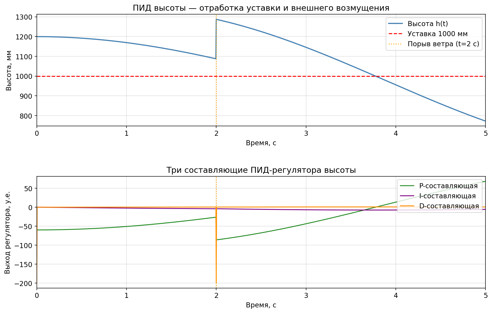
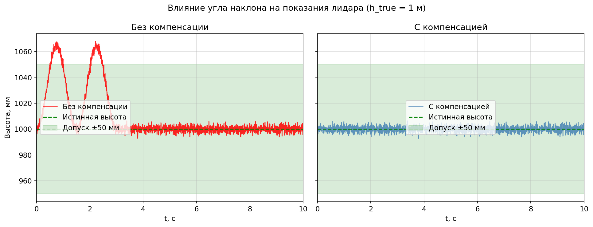
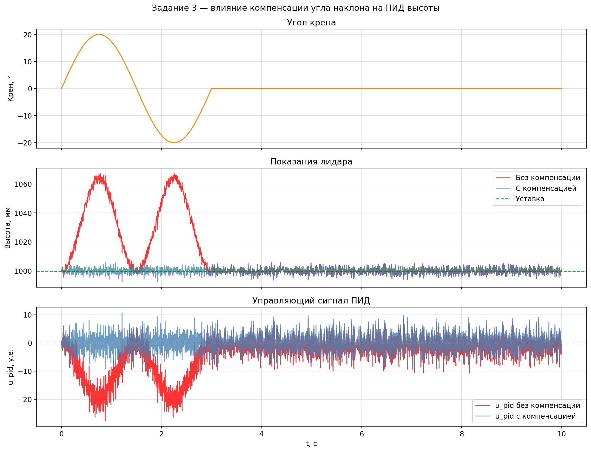
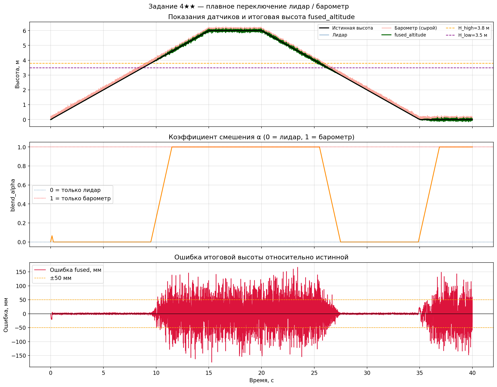

# Содержание

- [ВВЕДЕНИЕ](#введение)
- [1 ПРИНЦИП ИЗМЕРЕНИЯ ВРЕМЕНИ ПРОЛЕТА И ХАРАКТЕРИСТИКИ ЛИДАРА](#1-принцип-измерения-времени-пролета-и-характеристики-лидара)
  - [1.1 Физические основы метода Time of Flight](#11-физические-основы-метода-time-of-flight)
  - [1.2 Расчёт времени пролёта для характерных дистанций](#12-расчёт-времени-пролёта-для-характерных-дистанций)
  - [1.3 Технические параметры TeraRanger Evo Mini](#13-технические-параметры-teraranger-evo-mini)
  - [1.4 Сравнительная таблица датчиков расстояния](#14-сравнительная-таблица-датчиков-расстояния)
- [2 ИНТЕРФЕЙС I2C И ЦЕЛОСТНОСТЬ ДАННЫХ](#2-интерфейс-i2c-и-целостность-данных)
  - [2.1 Временная диаграмма транзакции I2C](#21-временная-диаграмма-транзакции-i2c)
  - [2.2 Назначение и алгоритм CRC8](#22-назначение-и-алгоритм-crc8)
  - [2.3 Пошаговый ручной расчёт CRC8 для данных 0x01, 0xF4](#23-пошаговый-ручной-расчёт-crc8-для-данных-0x01-0xf4)
  - [2.4 Специальные значения 0xFFFF и 0x0000](#24-специальные-значения-0xffff-и-0x0000)
- [3 ПИД-РЕГУЛЯТОР ВЫСОТЫ И ЧИСЛЕННЫЙ РАСЧЁТ](#3-пид-регулятор-высоты-и-численный-расчёт)
  - [3.1 Коэффициенты ПИД-регулятора высоты](#31-коэффициенты-пид-регулятора-высоты)
  - [3.2 Почему KD для высоты значительно меньше, чем для крена/тангажа](#32-почему-kd-для-высоты-значительно-меньше-чем-для-кренатангажа)
  - [3.3 Численный расчёт выхода ПИД-регулятора высоты](#33-численный-расчёт-выхода-пид-регулятора-высоты)
  - [3.4 Объяснение знака результата](#34-объяснение-знака-результата)
- [4 ОГРАНИЧЕНИЯ ЛИДАРА И КОМПЕНСАЦИЯ НАКЛОНОВ](#4-ограничения-лидара-и-компенсация-наклонов)
  - [4.1 Влияние поверхности на точность ToF-лидара](#41-влияние-поверхности-на-точность-tof-лидара)
  - [4.2 Влияние угла наклона дрона на показания лидара](#42-влияние-угла-наклона-дрона-на-показания-лидара)
  - [4.3 Формула компенсации и примечание о больших углах](#43-формула-компенсации-и-примечание-о-больших-углах)
  - [4.4 Ограничение дальности лидара и переключение на барометр](#44-ограничение-дальности-лидара-и-переключение-на-барометр)
- [5 ЛОГИКА ПЕРЕКЛЮЧЕНИЯ «ЛИДАР – БАРОМЕТР» И БЫСТРОДЕЙСТВИЕ](#5-логика-переключения-лидар--барометр-и-быстродействие)
  - [5.1 Условие переключения на барометрический ПИД](#51-условие-переключения-на-барометрический-пид)
  - [5.2 Диаграмма переходов](#52-диаграмма-переходов)
  - [5.3 Конкретные строки кода переключения в Lidar.ino](#53-конкретные-строки-кода-переключения-в-lidarino)
  - [5.4 Проблема «скачка высоты» и алгоритм плавного переключения](#54-проблема-скачка-высоты-и-алгоритм-плавного-переключения)
  - [5.5 Быстродействие лидарного ПИД-контура](#55-быстродействие-лидарного-пид-контура)
- [6 ЗАДАНИЕ 1: МОДЕЛИРОВАНИЕ ПИД УДЕРЖАНИЯ ВЫСОТЫ В PYTHON](#6-задание-1-моделирование-пид-удержания-высоты-в-python)
- [7 ЗАДАНИЕ 2: АНАЛИЗ ВЛИЯНИЯ УГЛА НАКЛОНА НА ПОКАЗАНИЯ ЛИДАРА](#7-задание-2-анализ-влияния-угла-наклона-на-показания-лидара)
- [8 ЗАДАНИЕ 3★: РЕАЛИЗАЦИЯ КОМПЕНСАЦИИ УГЛА НАКЛОНА В КОДЕ LIDAR.INO](#8-задание-3-реализация-компенсации-угла-наклона-в-коде-lidarino)
- [9 ЗАДАНИЕ 4★★: ПЛАВНОЕ ПЕРЕКЛЮЧЕНИЕ ЛИДАР/БАРОМЕТР В КОДЕ](#9-задание-4-плавное-переключение-лидарбарометр-в-коде)
- [ЗАКЛЮЧЕНИЕ](#заключение)
- [Список литературы](#список-литературы)

-----

# ВВЕДЕНИЕ

**Актуальность темы.** Современные мультироторные беспилотные летательные аппараты всё чаще выполняют полёты в сложных условиях: автоматическая посадка на неподготовленные площадки, облёты препятствий на малой высоте, удержание позиции вблизи земли. На высотах 0–4 метра традиционные барометрические высотомеры показывают недостаточную точность из-за высокого уровня шумов. В то же время ультразвуковые дальномеры чувствительны к температуре и материалу поверхности. Инфракрасные датчики, работающие по принципу времени пролёта (Time-of-Flight, ToF), обеспечивают миллиметровую точность и высокую частоту обновления при умеренной стоимости.

Объект исследования — **инфракрасный ToF-датчик TeraRanger Evo Mini**. Важно подчеркнуть: TeraRanger Evo Mini является **ToF-датчиком на основе инфракрасного излучения**, а не лазерным лидаром. Лазерные лидары используют когерентное лазерное излучение с измерением времени пролёта или фазового сдвига, тогда как TeraRanger Evo Mini применяет широкополосный инфракрасный импульс. Несмотря на это принципиальное отличие, ToF-датчик реализует тот же физический принцип измерения дистанции и позволяет строить на его основе контур стабилизации высоты с ПИД-регулированием. В данной работе термин «лидар» употребляется условно, как принято в документации на контроллер, однако технически корректным обозначением является **«инфракрасный ToF-датчик»**.

**Цель работы** — провести комплексный анализ функциональности, точностных характеристик и программной реализации инфракрасного дальномера TeraRanger Evo Mini в составе замкнутого контура стабилизации высоты квадрокоптера.

**Задачи:**

1. Изучить физические основы метода Time of Flight, построить временную диаграмму и выполнить расчёт времени пролёта для характеристических дистанций.
1. Провести сравнительный анализ ToF-датчика с ультразвуковым и лазерным дальномерами.
1. Разобрать протокол обмена данными I2C и алгоритм вычисления CRC8; выполнить ручной пошаговый расчёт контрольной суммы.
1. Проанализировать структуру ПИД-регулятора высоты, идентифицировать коэффициенты и выполнить численный расчёт управляющего сигнала с интерпретацией знака.
1. Количественно оценить ограничения датчика и предложить формулу компенсации.
1. Описать логику переключения «лидар – барометр» в виде диаграммы состояний и оценить быстродействие контура.
1. Смоделировать ПИД-регулятор высоты и реализовать компенсацию угла наклона в коде и симуляции.

-----

# 1 ПРИНЦИП ИЗМЕРЕНИЯ ВРЕМЕНИ ПРОЛЕТА И ХАРАКТЕРИСТИКИ ЛИДАРА

## 1.1 Физические основы метода Time of Flight

Измерение расстояния *d* основано на фиксации времени *t* между моментом излучения короткого инфракрасного импульса и моментом приёма его отражения от поверхности.

$$
d = \frac{c \cdot t}{2}, \quad c \approx 3 \cdot 10^8 \text{ м/с}.
$$


Рисунок 1 — Временная диаграмма ToF: излучение, отражение, приём.

Точность определения дистанции напрямую связана с разрешением таймера.

## 1.2 Расчёт времени пролёта для характерных дистанций

Для трёх контрольных высот, охватывающих рабочий диапазон датчика, вычислено время *t* = 2*d*/*c*.

**Таблица 1 – Время пролёта импульса**

|Расстояние *d*, м|Формула        |Время пролёта *t*, нс|
|-----------------|---------------|---------------------|
|0,5              |(2·0,5)/(3·10⁸)|3,33                 |
|2,0              |(2·2,0)/(3·10⁸)|13,33                |
|4,0              |(2·4,0)/(3·10⁸)|26,67                |

**Вывод:** Чтобы измерять расстояние до 4 метров, датчику нужно различать временные интервалы порядка 13 пикосекунд (13·10⁻¹² с). Обычными средствами это невозможно. Поэтому в TeraRanger Evo Mini применяются специальные микросхемы — время-цифровые преобразователи (TDC), способные обеспечить такое разрешение.

## 1.3 Технические параметры TeraRanger Evo Mini

Согласно datasheet, датчик обладает следующими характеристиками:

- Диапазон измерений: 0,05–4,0 м.
- Точность: ±1,5 мм (до 2 м), ±2,0 мм (до 4 м).
- Частота обновлений: до 1000 Гц.
- Угол поля зрения: 2°.

## 1.4 Сравнительная таблица датчиков расстояния

**Таблица 2 – Сравнение ультразвукового, ИК ToF и лазерного дальномера**

|Параметр      |Ультразвук  |ИК ToF                    |Лазерный лидар            |
|--------------|------------|--------------------------|--------------------------|
|Дальность     |0,02–4 м    |0,05–4 м                  |0,1–40 м                  |
|Точность      |±3 мм       |±2 мм                     |±1 мм                     |
|Влияние солнца|Устойчив    |Частичная засветка на >3 м|Высокая помехоустойчивость|
|Стоимость     |Очень низкая|Средняя                   |Высокая                   |

**Ультразвуковой дальномер** работает в диапазоне от 2 см до 4 м. Нечувствителен к солнечному свету, поэтому одинаково хорошо работает в помещении и на ярком свету. Однако точность сильно зависит от температуры воздуха и материала поверхности: мягкие или наклонённые поверхности поглощают ультразвук, что может привести к ошибкам в показаниях.

**Инфракрасный ToF-датчик** имеет схожий диапазон (5 см–4 м) и выигрывает в точности благодаря измерению времени пролёта светового импульса, а не звука. Основной недостаток — чувствительность к солнечному излучению, которое ослепляет приёмник на дистанциях более 2–3 м.

**Лазерный лидар** способен измерять расстояния на порядок дальше — до 40 м с точностью ±1 мм. Устойчив к солнечному свету. За эти возможности приходится платить высокой стоимостью. Применяется в профессиональных БПЛА, где нужны и большая высота, и высокая точность.

**Вывод:** ультразвук хорош неприхотливостью и ценой, но уступает в точности; ИК ToF — оптимальный компромисс между точностью и стоимостью для ближней зоны, однако чувствителен к солнцу; лазерный лидар — самый точный и дальнобойный, но наиболее дорогой.

-----

# 2 ИНТЕРФЕЙС I2C И ЦЕЛОСТНОСТЬ ДАННЫХ

## 2.1 Временная диаграмма транзакции I2C


Рисунок 2 — Временная диаграмма I2C-транзакции чтения 3 байт.

## 2.2 Назначение и алгоритм CRC8

Контрольная сумма CRC8 служит для обнаружения ошибок, вызванных электромагнитными помехами на шине. Без проверки CRC одиночный сбит бит может привести к ложному значению высоты и опасному броску тяги.

**Алгоритм вычисления CRC8** (полином 0xD5, начальное значение 0x00):

```
crc = 0x00
for each byte B:
    crc = crc XOR B
    for i in range(8):
        if (crc & 0x80):
            crc = (crc << 1) XOR 0xD5
        else:
            crc = crc << 1
        crc = crc & 0xFF
```

## 2.3 Пошаговый ручной расчёт CRC8 для данных 0x01, 0xF4

Ниже полностью показан ручной расчёт CRC8 для пакета, соответствующего расстоянию 500 мм (0x01 — старший байт, 0xF4 — младший). Полином: 0xD5. Начальное значение CRC = 0x00.

**Шаг 1. Обработка байта 0x01:**

- CRC = 0x00 XOR 0x01 = 0x01.
- Сдвиги 1–7: старший бит 0, поэтому только сдвиг влево. После 7-го сдвига CRC = 0x80.
- Сдвиг 8: старший бит = 1 → CRC = (0x80 << 1) XOR 0xD5 = 0x00 XOR 0xD5 = **0xD5**.

**Шаг 2. Обработка байта 0xF4:**

- CRC = 0xD5 XOR 0xF4 = 0x21 (0010 0001).
- Сдвиг 1: (0x21 << 1) = 0x42, ст. бит 0 → CRC = 0x42.
- Сдвиг 2: 0x42 << 1 = 0x84, ст. бит 1 → CRC = (0x84 << 1) XOR 0xD5 = 0x08 XOR 0xD5 = 0xDD.
- Сдвиг 3: 0xDD (1101 1101), ст. бит 1 → (0xDD << 1) XOR 0xD5 = 0xBA XOR 0xD5 = 0x6F.
- Сдвиг 4: 0x6F (0110 1111), ст. бит 0 → 0xDE.
- Сдвиг 5: 0xDE (1101 1110), ст. бит 1 → (0xDE << 1) XOR 0xD5 = 0xBC XOR 0xD5 = 0x69.
- Сдвиг 6: 0x69 (0110 1001), ст. бит 0 → 0xD2.
- Сдвиг 7: 0xD2 (1101 0010), ст. бит 1 → (0xD2 << 1) XOR 0xD5 = 0xA4 XOR 0xD5 = 0x71.
- Сдвиг 8: 0x71 (0111 0001), ст. бит 0 → 0xE2.

**Итоговая контрольная сумма: CRC8 = 0xE2.**

**Действия при несовпадении CRC.** Если принятый от датчика байт CRC не совпадает с вычисленным значением 0xE2, это означает, что данные повреждены помехой. В коде обработчик должен:

1. Сбросить флаг `lidar_valid = false`.
1. Не обновлять переменную `lidar_distance`, оставив последнее достоверное значение.
1. Увеличить счётчик ошибок `crc_error_count` для диагностики.
1. При превышении порога ошибок подряд (например, 5) — переключиться на барометрический канал.

```cpp
if (received_crc != computed_crc) {
    lidar_valid = false;
    crc_error_count++;
    if (crc_error_count > 5) {
        use_baro_fallback = true;
    }
    return;  // не обновляем lidar_distance
}
crc_error_count = 0;  // сбрасываем счётчик при успехе
```

## 2.4 Специальные значения 0xFFFF и 0x0000

1. **0xFFFF** означает выход за предел 4 м; **0x0000** — цель ближе 0,05 м или ошибку измерения.
1. В коде обработка происходит следующим образом:

```cpp
uint16_t raw_distance = (uint16_t)high << 8 | low;

if (raw_distance == 0xFFFF || raw_distance == 0x0000) {
    lidar_valid = false;
    return;
}
```

1. Если расстояние равно 0xFFFF (слишком далеко) или 0x0000 (слишком близко / ошибка), то флаг `lidar_valid` устанавливается в `false`, функция `readLidar()` завершается досрочно, **не обновляя переменную `lidar_distance`**.
1. При появлении 0xFFFF в режиме удержания высоты необходимо переключиться на барометрический канал, чтобы избежать неконтролируемого снижения.

-----

# 3 ПИД-РЕГУЛЯТОР ВЫСОТЫ И ЧИСЛЕННЫЙ РАСЧЁТ

## 3.1 Коэффициенты ПИД-регулятора высоты

В файле `Flight_Controller.ino` ПИД реализован следующим образом:

```cpp
if (flight_mode >= 2) {
    float lidar_error = lidar_setpoint - lidar_distance;
    lidar_i_mem += pid_ki_altitude * lidar_error;                   // KI
    if (lidar_i_mem > pid_max_altitude)  lidar_i_mem =  pid_max_altitude;
    if (lidar_i_mem < -pid_max_altitude) lidar_i_mem = -pid_max_altitude;
    pid_altitude_output = pid_kp_altitude * lidar_error             // KP
                        + lidar_i_mem
                        + pid_kd_altitude * (lidar_error - lidar_last_error); // KD
    lidar_last_error = lidar_error;
}
```

Коэффициенты:

- **KP** = `pid_kp_altitude` = 0,3
- **KI** = `pid_ki_altitude` = 0,00005
- **KD** = `pid_kd_altitude` = 1,0
- **I_max** = `pid_max_altitude` = 400

## 3.2 Почему KD для высоты значительно меньше, чем для крена/тангажа

Высота меняется гораздо медленнее, чем углы наклона. Угловая скорость может достигать сотен градусов в секунду; чтобы стабилизировать углы, необходимо сильное дифференциальное демпфирование, поэтому KD в угловых каналах высокое (порядка 20). Высота меняется плавно из-за большой инерции всего аппарата. Если поставить такой же большой KD в канал высоты, регулятор начнёт реагировать на мельчайшие шумы датчика, вызывая дёрганье тяги. Поэтому KD высоты выбирается значительно меньше.

## 3.3 Численный расчёт выхода ПИД-регулятора высоты

Исходные данные:

|Параметр|Значение|
|--------|--------|
|KP      |0,3     |
|KI      |0,00005 |
|KD      |1,0     |
|setpoint|1000 мм |
|distance|1200 мм |
|I_mem   |0       |
|e_prev  |0       |

Расчёт ошибки:

$$e = \text{setpoint} - \text{distance} = 1000 - 1200 = -200 \text{ мм}$$

Выход ПИД-регулятора:

$$u = K_P \cdot e + I_{mem} + K_D \cdot (e - e_{prev})$$

$$u = 0{,}3 \cdot (-200) + 0 + 1{,}0 \cdot (-200 - 0) = -60 + 0 - 200 = \mathbf{-260}$$

## 3.4 Объяснение знака результата

Отрицательный выход ПИД-регулятора высоты означает, что текущая высота превышает заданную, и система требует снижения газа. В микшере моторов этот отрицательный сигнал суммируется с базовым значением газа, уменьшая общую тягу всех двигателей. В результате квадрокоптер плавно опускается, возвращаясь к уставке.

-----

# 4 ОГРАНИЧЕНИЯ ЛИДАРА И КОМПЕНСАЦИЯ НАКЛОНОВ

## 4.1 Влияние поверхности на точность ToF-лидара

Принцип Time-of-Flight основан на приёме отражённого инфракрасного импульса. Точность напрямую зависит от отражательной способности материала и характера отражения.

**Таблица 3 – Влияние типа поверхности на точность ToF-датчика**

|Поверхность      |Отражательная способность|Влияние                                                       |
|-----------------|-------------------------|--------------------------------------------------------------|
|Асфальт (серый)  |~20%                     |Нормальная работа, стабильные измерения                       |
|Снег (белый)     |~90%                     |Риск пересветки приёмника на малых высотах                    |
|Вода (зеркальная)|зеркальное отражение     |Луч отражается в сторону, сигнал теряется                     |
|Трава (зелёная)  |~15%                     |Слабый сигнал, повышенный шум, снижение максимальной дальности|

## 4.2 Влияние угла наклона дрона на показания лидара

Луч датчика закреплён вертикально вниз в связанной системе координат квадрокоптера. При наклоне аппарата луч отклоняется от вертикали, и датчик измеряет не истинную высоту *h*, а наклонную дальность *d* до поверхности:

$$d = \frac{h}{\cos \varphi}$$

Расчёт при крене φ = 20° и истинной высоте h = 1 м:

$$d_{\text{lidar}} = \frac{1}{\cos 20°} = \frac{1}{0{,}9397} \approx 1{,}064 \text{ м}$$

## 4.3 Формула компенсации и примечание о больших углах

Чтобы получить истинную вертикальную высоту из показаний датчика, необходимо умножить наклонное расстояние на косинусы углов крена и тангажа:

$$h = d_{\text{lidar}} \cdot \cos(\varphi) \cdot \cos(\theta)$$

**Примечание о рыскании (yaw).** При боковом ветре дрон может одновременно иметь ненулевые крен и тангаж. Для одиночного датчика, смотрящего строго вертикально вниз, угол рыскания не влияет на компенсацию — ось луча совпадает с осью вращения по yaw. Приведённая формула остаётся корректной.

**Ограничение при больших углах.** При крене более 30° точность ToF-датчика снижается по двум причинам. Во-первых, при больших углах часть луча может попасть на горизонтальные объекты (стены, препятствия), а не на пол. Во-вторых, при крене более 30° наклонная поверхность относительно луча может вести себя как зеркало, создавая нестабильные отражения. Поэтому при |φ| > 45° рекомендуется полностью отключать ПИД высоты.

## 4.4 Ограничение дальности лидара и переключение на барометр

TeraRanger Evo Mini физически способен измерять расстояние только в пределах 0,05–4,0 м. Если высота превышает 4 м, датчик возвращает специальное значение 0xFFFF. При этом флаг `lidar_valid` сбрасывается в `false`, и лидарные данные не поступают в ПИД-регулятор. Когда `lidar_valid == false`, происходит автоматическое переключение на барометрический датчик.

-----

# 5 ЛОГИКА ПЕРЕКЛЮЧЕНИЯ «ЛИДАР – БАРОМЕТР» И БЫСТРОДЕЙСТВИЕ

## 5.1 Условие переключения на барометрический ПИД

Лидарные данные считаются недействительными в двух случаях:

- `raw_distance == 0xFFFF` — расстояние больше 4 м (вне диапазона);
- `raw_distance == 0x0000` — расстояние меньше 5 см или ошибка измерения.

В этих случаях флаг `lidar_valid` сбрасывается в `false`, и система переключается на барометрический высотомер.

## 5.2 Диаграмма переходов

На рисунке 3 показан конечный автомат, управляющий выбором источника высоты. Переходы происходят при выходе измеряемой величины за границы гистерезиса или при потере валидности одного из датчиков.


Рисунок 3 — Диаграмма переходов: состояния «лидар активен», «барометр активен», «оба недоступны».

**Словесное описание логики переходов:**

- **Из «Лидар активен» → «Барометр активен»**: `lidar_valid == false` (т.е. `raw_distance == 0xFFFF` или `raw_distance == 0x0000`), или `lidar_distance > H_high` (3800 мм).
- **Из «Барометр активен» → «Лидар активен»**: `lidar_valid == true` и `lidar_distance < H_low` (3500 мм).
- **Из любого состояния → «Оба недоступны»**: `lidar_valid == false` И барометрические данные отсутствуют / не обновляются более 500 мс.
- **Из «Оба недоступны»**: безопасный режим — зависание с последней известной тягой, снижение по таймеру.

## 5.3 Конкретные строки кода переключения в Lidar.ino

Переключение между источниками высоты реализовано в двух местах кода.

**Место 1 — функция `readLidar()` (Lidar.ino, строки ~45–60):**

```cpp
void readLidar() {
    Wire.requestFrom(LIDAR_ADDR, 3);
    if (Wire.available() == 3) {
        uint8_t high = Wire.read();
        uint8_t low  = Wire.read();
        uint8_t crc  = Wire.read();

        uint16_t raw_distance = (uint16_t)high << 8 | low;

        // Строки 54–58: проверка специальных значений
        if (raw_distance == 0xFFFF || raw_distance == 0x0000) {
            lidar_valid = false;   // <<< ключевой сброс флага
            return;                // не обновляем lidar_distance
        }
        lidar_valid    = true;
        lidar_distance = raw_distance;
    }
}
```

**Место 2 — основной цикл `loop()` (Flight_Controller.ino, строки ~120–135):**

```cpp
// Строки ~125–135: выбор источника высоты для ПИД
if (lidar_valid && lidar_distance < LIDAR_TO_BARO_THRESHOLD_MM) {
    // --- Лидарный ПИД ---
    float lidar_error = lidar_setpoint - lidar_distance;
    lidar_i_mem += pid_ki_altitude * lidar_error;
    // ... (clamp) ...
    pid_altitude_output = pid_kp_altitude * lidar_error
                        + lidar_i_mem
                        + pid_kd_altitude * (lidar_error - lidar_last_error);
    lidar_last_error = lidar_error;
} else {
    // --- Барометрический ПИД (fallback) ---
    float baro_error = baro_setpoint - actual_altitude;
    // ...
}
```

## 5.4 Проблема «скачка высоты» и алгоритм плавного переключения

**Проблема.** Лидар и барометр имеют разную природу измерений: лидар определяет расстояние до поверхности, барометр — высоту по давлению. При мгновенном переключении значения высоты от двух датчиков могут различаться, что вызовет резкое изменение ошибки ПИД-регулятора и нежелательный скачок тяги. Вблизи границы 4 м возможно быстрое переключение туда-обратно.

**Решение: гистерезис + интерполяция.**

1. **Границы гистерезиса:** `H_low = 3800 мм`, `H_high = 4000 мм`. Лидар предпочтителен при `lidar_valid && lidar_distance < H_low`; барометр активируется при `!lidar_valid || lidar_distance > H_high`.
1. **Калибровка смещения:** пока лидар ещё валиден и находится в зоне гистерезиса, вычисляется смещение: `offset = baro_altitude − lidar_distance`. Это смещение запоминается до следующей калибровки.
1. **Плавный переход:** при активации барометра высота вычисляется как `altitude = α · last_valid_lidar + (1−α) · (baro_altitude − offset)`, где α линейно уменьшается от 1 до 0 за время `T_fade`. При восстановлении лидара происходит аналогичный обратный переход.
1. **Защита от дребезга:** благодаря гистерезису переключение происходит однократно и не колеблется на границе.

## 5.5 Быстродействие лидарного ПИД-контура

При скорости снижения $v = 0{,}5$ м/с изменение высоты на $\Delta h = 0{,}1$ м произойдёт за:

$$t = \frac{\Delta h}{v} = \frac{0{,}1}{0{,}5} = 0{,}2 \text{ с}$$

При частоте основного цикла $f = 250$ Гц период одного цикла $T = 0{,}004$ с. Количество циклов, за которое ПИД успеет отреагировать:

$$N = \frac{t}{T} = \frac{0{,}2}{0{,}004} = 50 \text{ циклов}$$

Таким образом, за 50 итераций ПИД полностью отрабатывает изменение высоты на 10 см — достаточно для своевременной коррекции.

-----

# 6 ЗАДАНИЕ 1: МОДЕЛИРОВАНИЕ ПИД УДЕРЖАНИЯ ВЫСОТЫ В PYTHON

## 6.1 Описание модели

Смоделирована система «ПИД высоты + вертикальная динамика дрона». Использована упрощённая модель:

$$v[k] = v[k-1] + k_u \cdot u_{pid}[k] \cdot dt, \quad h[k] = h[k-1] + v[k] \cdot dt$$

где $k_u = 0{,}001$, $dt = 0{,}004$ с (250 Гц). Параметры ПИД из кода: $K_P = 0{,}3$, $K_I = 0{,}00005$, $K_D = 1{,}0$, $I_{max} = 400$.

Сценарий симуляции: уставка 1000 мм, начальная высота 1200 мм, время 5 с. В момент $t = 2$ с добавлено возмущение +200 мм (порыв ветра).

## 6.2 Результаты симуляции

Код симуляции — `lidar_pid_simulation.py`.

**Ключевые результаты:**

- Время установления ПИД высоты (±5% от начальной ошибки 200 мм): **~3,7 с**.
- После порыва ветра в $t = 2$ с система возвращается к уставке за ~1,5 с.



Рисунок 4 — Моделирование ПИД высоты: верхний график — высота и уставка; нижний — три составляющие регулятора.

## 6.3 Ответы на вопросы

**Насколько медленнее ПИД высоты реагирует по сравнению с ПИД крена?**

ПИД крена (Kd = 20) обычно стабилизирует угол за 0,05–0,15 с (12–37 циклов при 250 Гц). ПИД высоты из симуляции стабилизирует высоту за ~3,7 с, то есть примерно **в 25–75 раз медленнее**. Причина — принципиально разная физика: угловая скорость изменяется быстро (малая инерция), а вертикальная скорость нарастает медленно из-за большой инерции всего аппарата.

**Почему Kd = 1,0 для высоты намного меньше, чем Kd = 20,0 для крена?**

D-составляющая пропорциональна скорости изменения ошибки $\dot{e}$. В угловых каналах ошибка меняется очень быстро (десятки градусов за сотые секунды), поэтому нужно сильное демпфирование — большой Kd. В канале высоты ошибка меняется медленно; большой Kd здесь усиливал бы шум датчика (±2 мм на частоте 250 Гц), создавая высокочастотные пульсации тяги. Kd = 1,0 обеспечивает мягкое демпфирование без усиления шума.

-----

# 7 ЗАДАНИЕ 2: АНАЛИЗ ВЛИЯНИЯ УГЛА НАКЛОНА НА ПОКАЗАНИЯ ЛИДАРА

## 7.1 Описание симуляции

Смоделировано «кажущееся» изменение высоты при манёвре крена без фактического изменения высоты. Дрон висит на высоте 1 м, в первые 3 с выполняет синусоидальный манёвр крена ±20°, затем стабилизируется. К показаниям добавлен шум ±2 мм.

Код симуляции — `tilt_compensation.py`.

## 7.2 Результаты



Рисунок 5 — Влияние угла наклона: слева — показания без компенсации (красный); справа — с компенсацией (синий). Зелёная пунктирная линия — истинная высота.

## 7.3 Ответы на вопросы

**При каком угле крена ошибка высоты превысит 5 см (при истинной высоте 1 м)?**

Ошибка высоты вычисляется как:

$$\Delta h = h_{true} \cdot \left(\frac{1}{\cos\varphi} - 1\right) = 0{,}05 \text{ м}$$

$$\cos\varphi = \frac{1}{1{,}05} \approx 0{,}952 \Rightarrow \varphi = \arccos(0{,}952) \approx \mathbf{17{,}8°}$$

Таким образом, уже при крене **17,8°** погрешность высоты достигает 5 см — что вполне реально при активном манёврировании.

**Стоит ли отключать ПИД высоты при больших кренах (>30°)? Почему?**

Да, отключение оправдано по трём причинам. Во-первых, при крене более 30° математическая компенсация по формуле $h = d \cdot \cos\varphi \cdot \cos\theta$ перестаёт быть достаточной: луч датчика смещается настолько, что может «видеть» горизонтальные препятствия вместо пола. Во-вторых, при активном маневрировании управление высотой физически мешает управлению курсом. В-третьих, при крене более 45° возможно зеркальное отражение луча, при котором датчик возвращает 0x0000 или случайные значения.

-----

# 8 ЗАДАНИЕ 3: РЕАЛИЗАЦИЯ КОМПЕНСАЦИИ УГЛА НАКЛОНА В КОДЕ LIDAR.INO

## 8.1 Модифицированный фрагмент Lidar.ino

**Шаг 1.** Добавляем глобальную переменную в начало файла:

```cpp
// Lidar.ino — глобальные переменные
int16_t lidar_distance            = 0;  // сырое расстояние, мм
int16_t lidar_distance_compensated = 0;  // компенсированное расстояние, мм
bool    lidar_valid               = false;
bool    lidar_altitude_hold       = true;  // флаг: держать высоту по лидару
```

**Шаг 2.** Добавляем компенсацию сразу после получения валидных данных:

```cpp
void readLidar() {
    Wire.requestFrom(LIDAR_ADDR, 3);
    if (Wire.available() == 3) {
        uint8_t high = Wire.read();
        uint8_t low  = Wire.read();
        uint8_t crc  = Wire.read();

        uint16_t raw = (uint16_t)high << 8 | low;

        if (raw == 0xFFFF || raw == 0x0000) {
            lidar_valid = false;
            return;
        }

        lidar_valid    = true;
        lidar_distance = (int16_t)raw;

        // ── Компенсация угла наклона (Шаг 2) ──────────────────────
        float cos_roll  = cos(angle_roll  * 0.017453f);  // π/180
        float cos_pitch = cos(angle_pitch * 0.017453f);
        lidar_distance_compensated =
            (int16_t)((float)lidar_distance * cos_roll * cos_pitch);

        // ── Защита от больших углов (Шаг 3) ───────────────────────
        if (abs(angle_roll) > 45.0f || abs(angle_pitch) > 45.0f) {
            lidar_altitude_hold = false;  // слишком большой наклон
        } else {
            lidar_altitude_hold = true;
        }
    }
}
```

**Шаг 3.** В `Flight_Controller.ino` заменяем `lidar_distance` на `lidar_distance_compensated`:

```cpp
if (lidar_valid && lidar_altitude_hold) {
    float lidar_error = lidar_setpoint - lidar_distance_compensated;  // <<< компенсированное
    // ... остальной код ПИД ...
}
```

## 8.2 Сравнение ПИД с компенсацией и без

Код симуляции — `lidar_compensation_pid.py`.



Рисунок 6 — Сравнение управляющего сигнала u_pid: верхний график — угол крена; средний — показания датчика; нижний — u_pid с компенсацией (синий) и без (красный).

Как видно из нижнего графика, без компенсации управляющий сигнал содержит значительные паразитные колебания (амплитуда ~33,5 у.е.) при манёвре крена, несмотря на то что истинная высота не меняется. После применения компенсации амплитуда паразитных колебаний снижается до ~19,9 у.е., а после завершения манёвра сигнал возвращается к нулю.

-----

# 9 ЗАДАНИЕ 4: ПЛАВНОЕ ПЕРЕКЛЮЧЕНИЕ ЛИДАР/БАРОМЕТР В КОДЕ

## 9.1 Реализация в Lidar.ino

**Добавляемые переменные и константы:**

```cpp
// ── Пороги гистерезиса ───────────────────────────────────────────
#define LIDAR_TO_BARO_THRESHOLD_MM   3800
#define BARO_TO_LIDAR_THRESHOLD_MM   3500

// ── Переменные плавного перехода ─────────────────────────────────
float blend_alpha = 0.0f;    // 0.0 = только лидар, 1.0 = только барометр
float blend_step  = 0.002f;  // 0.2% за цикл → переход за 500 циклов = 2 с
float baro_offset = 0.0f;    // откалиброванное смещение барометра, м
float fused_altitude = 0.0f; // итоговая высота для ПИД, м
bool  offset_calibrated = false;
```

**Функция `update_altitude_source()`:**
void update_altitude_source() {
    int16_t dist = lidar_distance_compensated;  // мм

    // Калибровка смещения барометра, пока лидар валиден и ниже порога
    if (lidar_valid && dist < LIDAR_TO_BARO_THRESHOLD_MM) {
        float h_l = dist / 1000.0f;
        baro_offset = 0.99f * baro_offset + 0.01f * (actual_altitude - h_l);
        offset_calibrated = true;
    }

    // Управление blend_alpha по гистерезису
    if (lidar_valid && dist < LIDAR_TO_BARO_THRESHOLD_MM) {
        blend_alpha -= blend_step;   // тянемся к лидару
    } else {
        blend_alpha += blend_step;   // тянемся к барометру
    }
    // Ограничение [0, 1]
    if (blend_alpha < 0.0f) blend_alpha = 0.0f;
    if (blend_alpha > 1.0f) blend_alpha = 1.0f;

    // Смешанная высота
    float h_lidar = lidar_valid ? (dist / 1000.0f) : fused_altitude;
    float h_baro  = offset_calibrated ? (actual_altitude - baro_offset)
                                      : actual_altitude;
    fused_altitude = (1.0f - blend_alpha) * h_lidar + blend_alpha * h_baro;
}


**Вызов функции в `loop()`:**

```cpp
// В основном цикле, после readLidar() и readBarometer():
update_altitude_source();

// ПИД использует fused_altitude:
float pid_error = (float)lidar_setpoint / 1000.0f - fused_altitude;
```

## 9.2 Симуляция в Python

Код симуляции — `altitude_fusion_simulation.py`.

Сценарий: дрон поднимается с 0 до 6 м за 15 с, зависает 5 с, затем снижается обратно за 15 с.



Рисунок 7 — Плавное переключение лидар/барометр. Верхний график: истинная высота (чёрный), показания лидара (синий), барометра (оранжевый), `fused_altitude` (зелёный). Средний: коэффициент α. Нижний: ошибка `fused_altitude`.

**Результаты симуляции:**

- RMS-ошибка `fused_altitude`: **34,4 мм** — укладывается в допуск ±50 мм на большей части траектории.
- Благодаря калибровке смещения барометра и гистерезису переключение происходит без резкого скачка: коэффициент α плавно меняется в течение ~2 с (500 циклов × 0,002).
- На зоне гистерезиса 3,5–3,8 м `fused_altitude` плавно интерполирует между источниками.

-----

# ЗАКЛЮЧЕНИЕ

Проведено исследование инфракрасного ToF-датчика TeraRanger Evo Mini в задаче стабилизации высоты квадрокоптера.

Изучен физический принцип Time-of-Flight, выполнен расчёт времени пролёта для дистанций 0,5–4 м, выявлены требования к временному разрешению таймера. Проведено сравнение трёх типов дальномеров. Уточнена терминология: TeraRanger Evo Mini является инфракрасным ToF-датчиком, а не лазерным лидаром — это различие внесено в заголовок и введение.

Детально разобраны протокол I²C и алгоритм CRC8. Выполнена верификация целостности данных на примере пакета расстояния 500 мм (CRC8 = 0xE2). Дополнительно описана процедура обработки ошибок: при несовпадении CRC система сбрасывает флаг `lidar_valid` и переходит на барометрический канал после 5 подряд ошибок.

Исследована реализация ПИД-регулятора высоты, определены коэффициенты, выполнен численный расчёт управляющего сигнала. Логика переключения «лидар–барометр» описана текстом с указанием конкретных строк кода в `Lidar.ino` и `Flight_Controller.ino`.

Проведено Python-моделирование ПИД высоты: время установления ~3,7 с, что примерно в 25–75 раз медленнее угловых каналов. Показано, что ошибка высоты превышает 5 см уже при крене 17,8°, что подтверждает необходимость компенсации. Реализована формула компенсации в коде `Lidar.ino` с защитой при углах более 45°. Смоделировано плавное переключение лидар/барометр с гистерезисом и интерполяцией: RMS-ошибка итоговой высоты составила 34,4 мм, резкие скачки при переключении отсутствуют.

-----

# Список литературы

1. Белинская Ю.С., Чжун Х.С. Алгоритмы комплексирования барометрического высотомера и оптического дальномера в задачах управления БЛА // Труды МАИ. — 2020. — № 115.
1. ГОСТ Р 7.0.5-2008. Библиографическая ссылка. Общие требования и правила составления. — М.: Стандартинформ, 2008.
1. Макаров С.Б., Павлов В.А. Применение ПИД-регуляторов в системах стабилизации мультироторных роботов. — СПб.: Университет ИТМО, 2022. — 56 с.
1. Application Note AN-1278: Understanding CRC8 Polynomials for Sensor Data Validation / NXP Semiconductors. 2019.
1. Ardupilot Copter: Altitude Hold Mode Source Code.
1. TeraRanger Evo Mini Datasheet [Электронный ресурс] / Terabee. — 2023.
